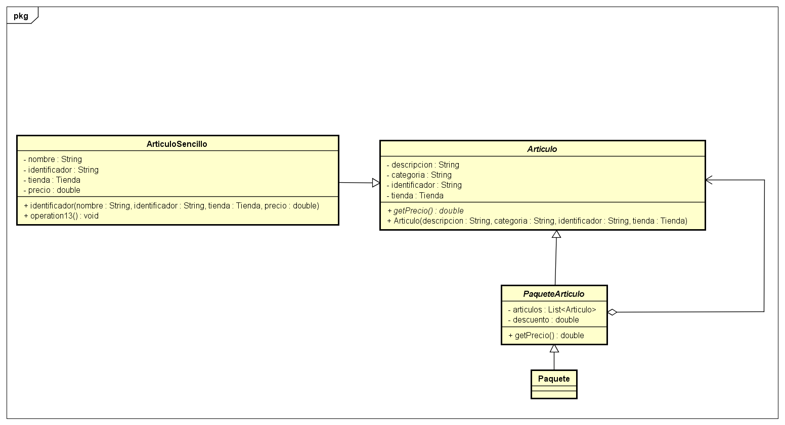
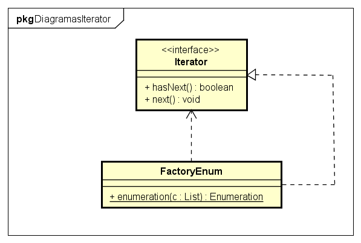

# Centro comercial

Proyecto para la asignatura Diseño de software, el cual consiste en una simulación de un centro comerial.

## Getting Started

asd

### Prerequisites


Java 8 o superior.


### Installing

Descargar la carpeta de ejecutable :V

## Running the tests

Explain how to run the automated tests for this system

### Patrones de diseño utilizados

Patrones:

```
    Singleton
    Decorator
    Factory
    Observer
    Iterator
```

### Diagramas de cada patron:
# Singleton:


# Decorator:


# Iterator:


# Factory:


# Observer:


## Deployment

Add additional notes about how to deploy this on a live system

## Built With

* [Java 8 swing](https://www.java.com/es/download/) - Lenguaje principal


## Contributing


## Versioning


## Authors

* **Emmanue Chable** - *Initial work* - [SonBear](https://github.com/SonBear)
* **Nicólas Ibarra** - *full* - [HikingCarrot7](https://github.com/HikingCarrot7)
* **Eusebio Ajas** - *full* - [EusebioAjas](https://github.com/EusebioAjas)

See also the list of [contributors](https://github.com/SonBear/Proyecto_DisSoft/graphs/contributors) who participated in this project.

## License

F

## Acknowledgments

* Disco duro de roer :V

