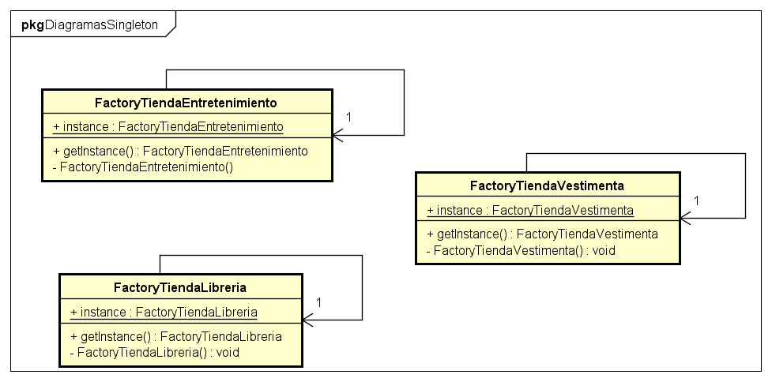

# Centro comercial

Proyecto para la asignatura Diseño de software, el cual consiste en una simulación de un centro comercial.

## Para empezar

Este proyecto fue elaborado para mejorar el entendimiento de algunos Patrones de diseño.

### Prerequisites


Java 8 o superior.


### Installing
*Instalar Java 8 o superior
*Descargar la carpeta de ejecutable
*Ejecutar el archivo .jar

## Descripción
Centro comercial, que nos presenta una lista de clientes y tiendas, despúes de seleccionar un cliente y solicitar un carrito de compras, podrá a empezar a añadir elementos a su carrito, para luego procesar un pago.

### Patrones de diseño utilizados

Patrones:

```
    Singleton
    Decorator
    Factory
    Observer
    Iterator
```

### Diagramas de cada patron:

#### Singleton:


<p align="center">
  
</p>

Este patrón es utilizado para generar una única instancia de las clases CFactory y CajaRegistradora de esta manera no se crearán más objetos de estas clases, ya que estas clases no necesitan ser modificadas porque brindan métodos que no necesitan cambios internos de su clase.


#### Decorator:

Para esta situación, el uso del patrón Decorator nos es muy útil para crear paquetes de artículos e incluso paquetes de paquetes, ya que cada paquete es un artículo. De igual forma, el precio para un paquete se puede calcular de una manera muy sencilla siguiendo el diseño que este patrón nos ofrece.	 


#### Iterator:


Los objectos Enumeration<T> son utilizados para recorrer una colección de elementos en algún orden no especificado. Para nuestro caso, estos objectos se usan para iterar sobre algún conjunto de datos (clientes o artículos) y posteriormente ir mostrándolos en pantalla (tablas o listas).


#### Factory:


La clase CFactoryTienda nos permite generar tiendas sin necesidad de conocer cosas innecesarias, solo importa pasarle un identificador de alguna tienda, y este se encargará de crearla.


#### Observer:


La manera de implementar este patrón es muy sencilla, debemos tener dos clases que estarán mutuamente relacionadas Observador y Observado
Observador es una interfaz que definirá métodos, los cuales se enfocarán en mostrar como una clase reaccionará ante las acciones de un Observado.
Observado es una clase abstracta que contiene objetos Observadores dentro de él, ya que mediante el un método notificara a los Observadores de algún cambio dentro de él.


#### State:

Este patrón es utilizado para la clase CarritoCompras el cuál nos ayuda a procesar los estados que el carrito tiene cuando se ejecuta una acción. Este patrón también es utilizado para la parte gráfica uniéndolo con el patrón Observer nos permite actualizar elementos visuales que representan al carrito.


## Creado con:
* [Java 8 swing](https://www.java.com/es/download/) - Lenguaje principal


## Version


## Authors

* **Emmanue Chable** - *Initial work* - [SonBear](https://github.com/SonBear)
* **Nicólas Ibarra** - *full* - [HikingCarrot7](https://github.com/HikingCarrot7)


Lista de contribución [contributors](https://github.com/SonBear/Proyecto_DisSoft/graphs/contributors) que
han participado en el proyecto.
